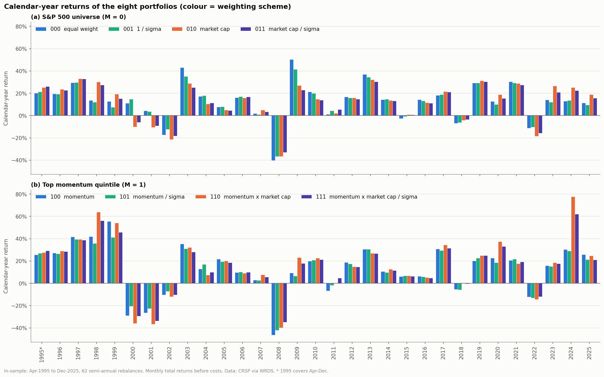
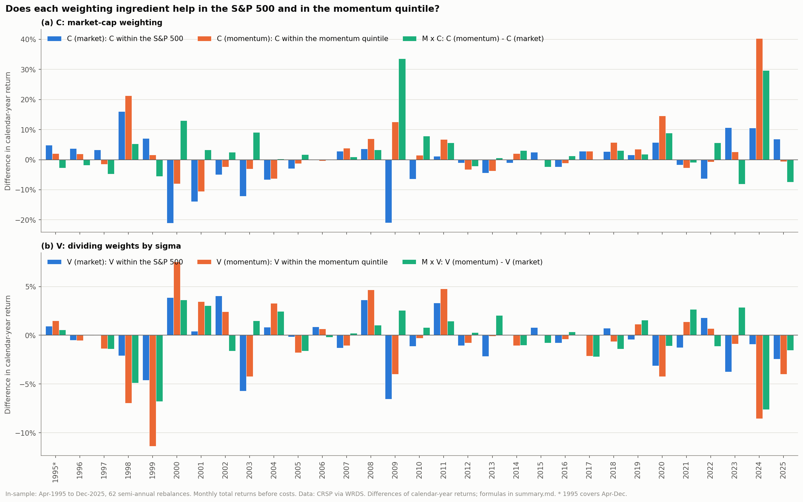
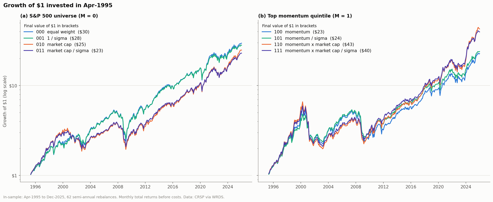
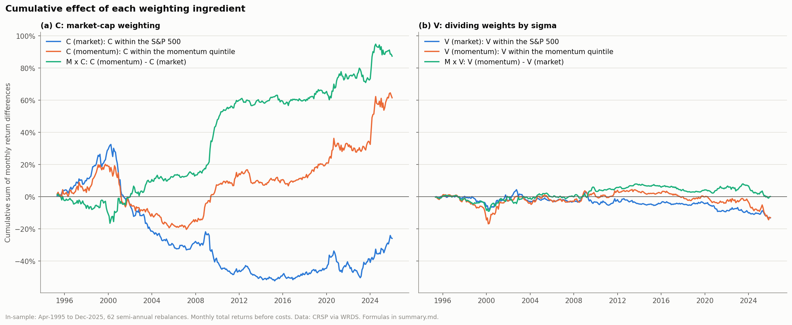
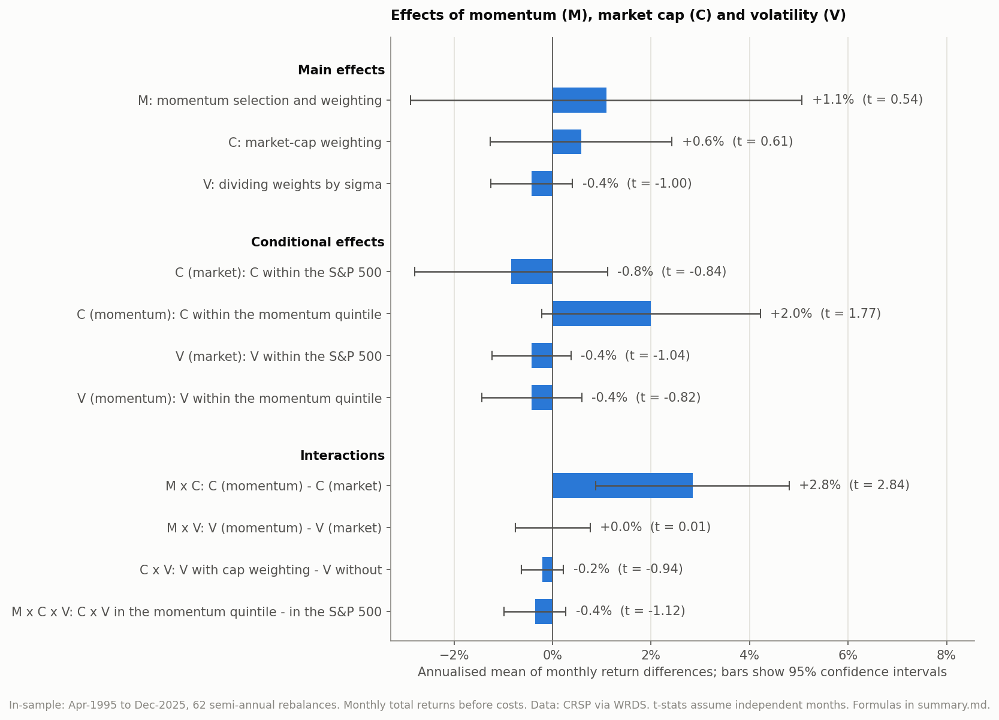
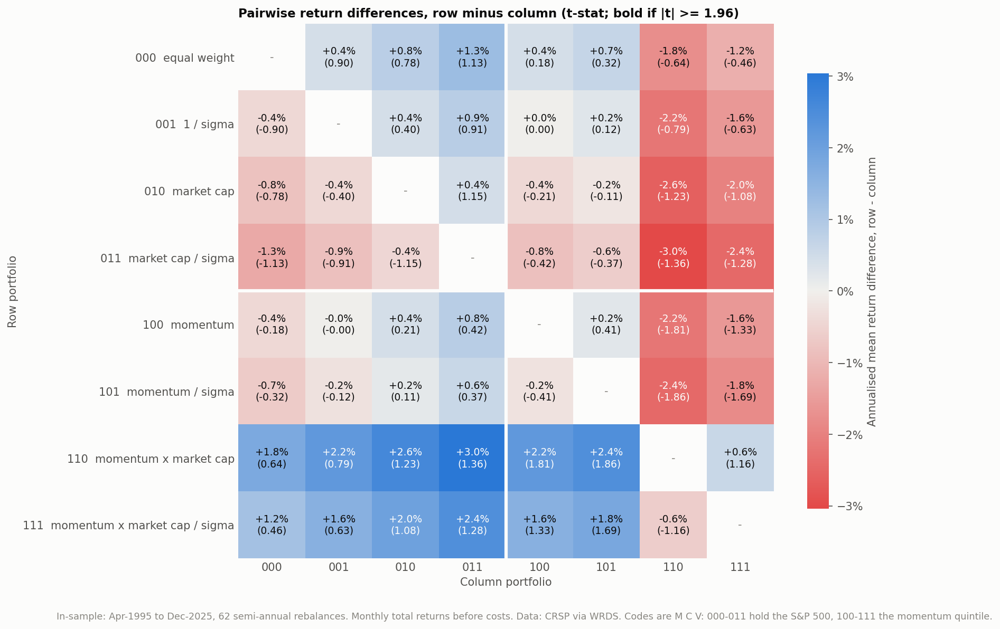
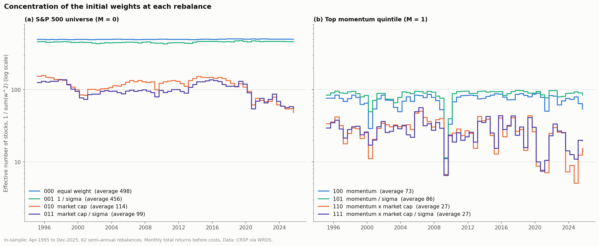
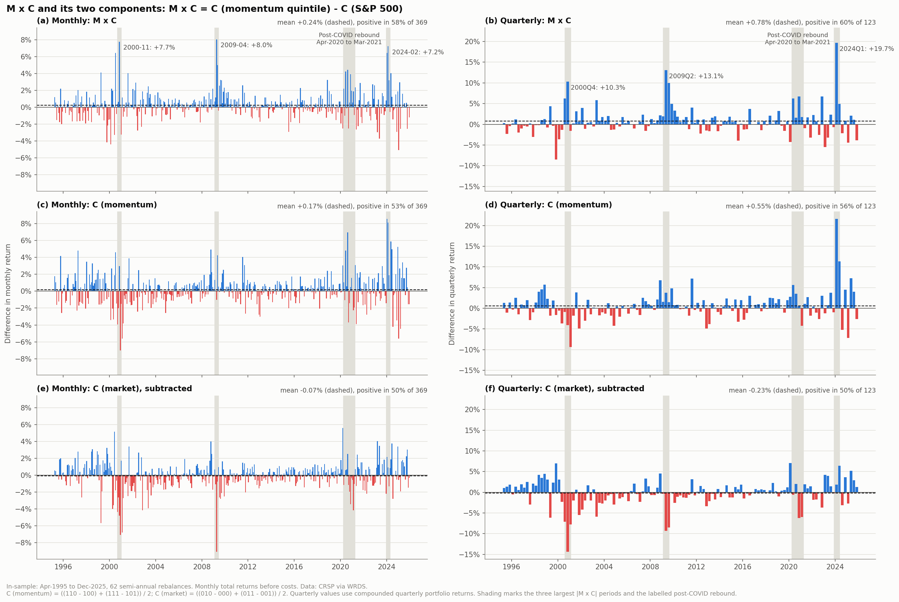
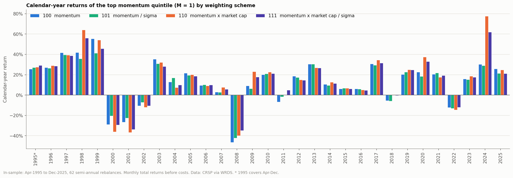

# Attribution: momentum, market cap and volatility

Generated by `scripts/04_attribution.py`. In-sample only: Apr-1995 to Dec-2025 (369 months, 62 semi-annual rebalances). Codes give the ingredients used: **M**omentum, market **C**ap, **V**olatility. M = 1 selects the top quintile on momentum / sigma and weights by momentum; C = 1 multiplies the weights by market cap; V = 1 divides them by sigma. Returns are before costs.

## Portfolios

Return is the compound annual growth rate. Sharpe ratio uses the one-month T-bill rate. Effective N is 1 / sum(w^2) of the weights set at each rebalance, averaged over rebalances.

| Portfolio | Annual return | Annual volatility | Sharpe ratio | Max drawdown | Avg. effective N |
|---|---|---|---|---|---|
| `000` S&P 500, equal weight | 11.7% | 16.7% | 0.61 | -54.9% | 498 |
| `001` S&P 500, 1 / sigma | 11.5% | 15.2% | 0.64 | -51.6% | 456 |
| `010` S&P 500, market cap | 11.0% | 15.2% | 0.61 | -50.0% | 114 |
| `011` S&P 500, market cap / sigma | 10.7% | 14.0% | 0.64 | -46.8% | 99 |
| `100` Top quintile, momentum | 10.7% | 19.1% | 0.51 | -61.1% | 73 |
| `101` Top quintile, momentum / sigma | 10.9% | 17.0% | 0.56 | -52.0% | 86 |
| `110` Top quintile, momentum x market cap | 13.0% | 19.7% | 0.60 | -70.1% | 27 |
| `111` Top quintile, momentum x market cap / sigma | 12.7% | 17.8% | 0.63 | -64.5% | 27 |
| `111 capped` SPMO proxy with the weight cap | 12.4% | 17.4% | 0.63 | -64.1% |  |
| `SPY` SPY ETF | 10.8% | 15.0% | 0.60 | -50.8% |  |

`111` is the SPMO proxy without the weight cap, so that neighbouring portfolios differ in one ingredient only. `111 capped` and SPY are shown for reference.

## Effects

Linear combinations of monthly returns. The annualised mean is 12 x the monthly mean; the t-stat assumes independent months. Years positive is the share of calendar years in which the same combination of annual returns is positive.

| Group | Effect | Description | Formula | Annualised mean | t-stat | Years positive |
|---|---|---|---|---|---|---|
| Main effects | M | momentum selection and weighting | `((100 - 000) + (101 - 001) + (110 - 010) + (111 - 011)) / 4` | 1.1% | 0.54 | 54.8% |
| Main effects | C | market-cap weighting | `((010 - 000) + (011 - 001) + (110 - 100) + (111 - 101)) / 4` | 0.6% | 0.61 | 54.8% |
| Main effects | V | dividing weights by sigma | `((001 - 000) + (011 - 010) + (101 - 100) + (111 - 110)) / 4` | -0.4% | -1.00 | 41.9% |
| Conditional effects | C (market) | C within the S&P 500 | `((010 - 000) + (011 - 001)) / 2` | -0.8% | -0.84 | 51.6% |
| Conditional effects | C (momentum) | C within the momentum quintile | `((110 - 100) + (111 - 101)) / 2` | 2.0% | 1.77 | 54.8% |
| Conditional effects | V (market) | V within the S&P 500 | `((001 - 000) + (011 - 010)) / 2` | -0.4% | -1.04 | 41.9% |
| Conditional effects | V (momentum) | V within the momentum quintile | `((101 - 100) + (111 - 110)) / 2` | -0.4% | -0.82 | 38.7% |
| Interactions | M x C | C (momentum) - C (market) | `((110 - 100) + (111 - 101)) / 2 - ((010 - 000) + (011 - 001)) / 2` | 2.8% | 2.84 | 67.7% |
| Interactions | M x V | V (momentum) - V (market) | `((101 - 100) + (111 - 110)) / 2 - ((001 - 000) + (011 - 010)) / 2` | 0.0% | 0.01 | 51.6% |
| Interactions | C x V | V with cap weighting - V without | `((011 - 010) + (111 - 110)) / 2 - ((001 - 000) + (101 - 100)) / 2` | -0.2% | -0.94 | 45.2% |
| Interactions | M x C x V | C x V in the momentum quintile - in the S&P 500 | `((111 - 110) - (101 - 100)) - ((011 - 010) - (001 - 000))` | -0.4% | -1.12 | 51.6% |

## Pairwise differences

Annualised mean of the monthly return difference, row minus column, with the t-stat in brackets. Also in `difference_matrix.csv`.

| Row - column | `000` | `001` | `010` | `011` | `100` | `101` | `110` | `111` |
|---|---|---|---|---|---|---|---|---|
| `000` |  | +0.4% (0.90) | +0.8% (0.78) | +1.3% (1.13) | +0.4% (0.18) | +0.7% (0.32) | -1.8% (-0.64) | -1.2% (-0.46) |
| `001` | -0.4% (-0.90) |  | +0.4% (0.40) | +0.9% (0.91) | +0.0% (0.00) | +0.2% (0.12) | -2.2% (-0.79) | -1.6% (-0.63) |
| `010` | -0.8% (-0.78) | -0.4% (-0.40) |  | +0.4% (1.15) | -0.4% (-0.21) | -0.2% (-0.11) | -2.6% (-1.23) | -2.0% (-1.08) |
| `011` | -1.3% (-1.13) | -0.9% (-0.91) | -0.4% (-1.15) |  | -0.8% (-0.42) | -0.6% (-0.37) | -3.0% (-1.36) | -2.4% (-1.28) |
| `100` | -0.4% (-0.18) | -0.0% (-0.00) | +0.4% (0.21) | +0.8% (0.42) |  | +0.2% (0.41) | -2.2% (-1.81) | -1.6% (-1.33) |
| `101` | -0.7% (-0.32) | -0.2% (-0.12) | +0.2% (0.11) | +0.6% (0.37) | -0.2% (-0.41) |  | -2.4% (-1.86) | -1.8% (-1.69) |
| `110` | +1.8% (0.64) | +2.2% (0.79) | +2.6% (1.23) | +3.0% (1.36) | +2.2% (1.81) | +2.4% (1.86) |  | +0.6% (1.16) |
| `111` | +1.2% (0.46) | +1.6% (0.63) | +2.0% (1.08) | +2.4% (1.28) | +1.6% (1.33) | +1.8% (1.69) | -0.6% (-1.16) |  |

## Figures

