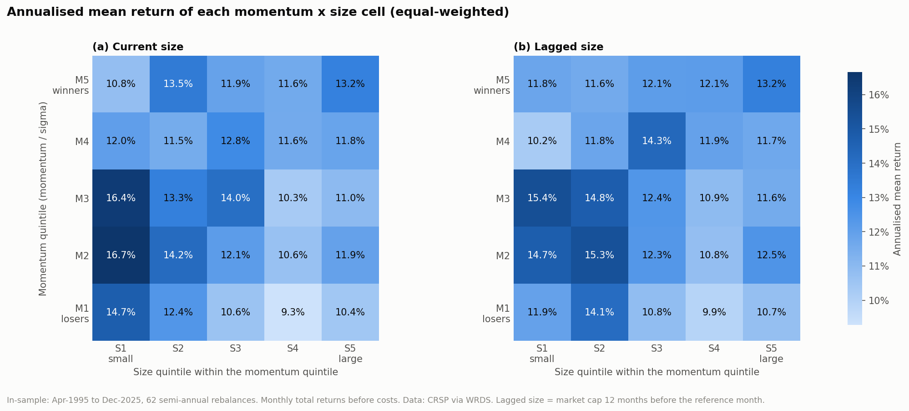
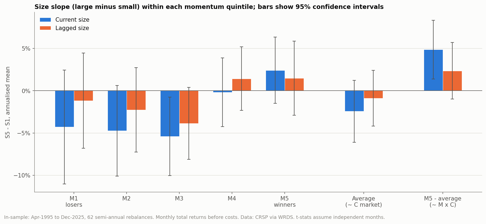
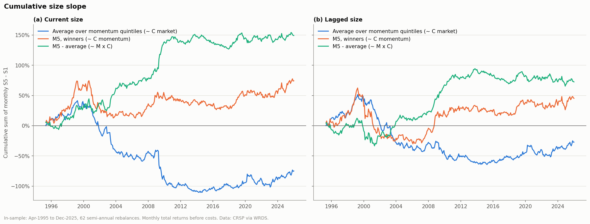
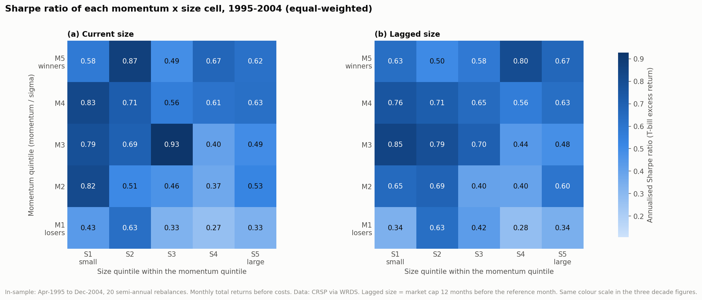
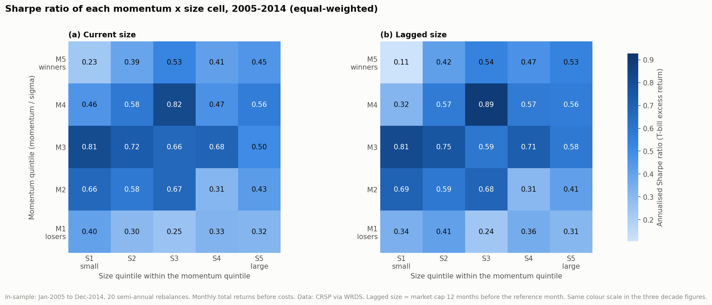
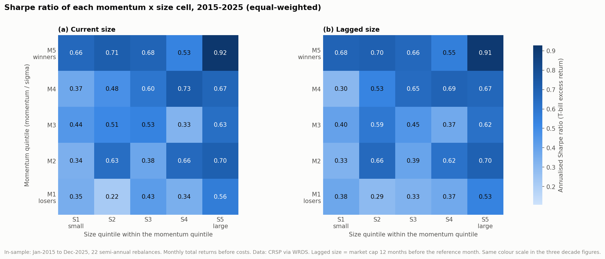

# Double sort: momentum x size within the S&P 500

Generated by `scripts/06_double_sort.py`. In-sample only: Apr-1995 to Dec-2025 (62 semi-annual rebalances). Same universe, rebalancing and holding period as the attribution; each rebalance sorts the universe into quintiles of momentum / sigma, then each momentum quintile into size quintiles. Cells are equal-weighted. Returns before costs. Annualised means are 12 x the monthly mean; t-stats assume independent months.

Average stocks per cell: 19.9 (current size), 19.9 (lagged size). Stock-rebalances without a market cap at t-12, dropped from the lagged sort: 0.

## Annualised mean return by cell: current size (market cap at the reference month)

| Momentum quintile | S1 small | S2 | S3 | S4 | S5 large | S5 - S1 (t) |
|---|---|---|---|---|---|---|
| M5 (winners) | 10.8% | 13.5% | 11.9% | 11.6% | 13.2% | +2.4% (1.21) |
| M4 | 12.0% | 11.5% | 12.8% | 11.6% | 11.8% | -0.2% (-0.09) |
| M3 | 16.4% | 13.3% | 14.0% | 10.3% | 11.0% | -5.4% (-2.27) |
| M2 | 16.7% | 14.2% | 12.1% | 10.6% | 11.9% | -4.7% (-1.73) |
| M1 (losers) | 14.7% | 12.4% | 10.6% | 9.3% | 10.4% | -4.3% (-1.25) |

## Annualised mean return by cell: lagged size (market cap 12 months earlier, before the momentum window)

| Momentum quintile | S1 small | S2 | S3 | S4 | S5 large | S5 - S1 (t) |
|---|---|---|---|---|---|---|
| M5 (winners) | 11.8% | 11.6% | 12.1% | 12.1% | 13.2% | +1.5% (0.66) |
| M4 | 10.2% | 11.8% | 14.3% | 11.9% | 11.7% | +1.4% (0.74) |
| M3 | 15.4% | 14.8% | 12.4% | 10.9% | 11.6% | -3.9% (-1.79) |
| M2 | 14.7% | 15.3% | 12.3% | 10.8% | 12.5% | -2.3% (-0.89) |
| M1 (losers) | 11.9% | 14.1% | 10.8% | 9.9% | 10.7% | -1.2% (-0.41) |

## Size slope by momentum quintile

Annualised mean of the monthly S5 - S1 return difference, t-stat in brackets. A positive slope means large stocks outperformed small stocks within that momentum quintile.

| Size slope, S5 - S1 | current size | lagged size |
|---|---|---|
| M1 | -4.3% (-1.25) | -1.2% (-0.41) |
| M2 | -4.7% (-1.73) | -2.3% (-0.89) |
| M3 | -5.4% (-2.27) | -3.9% (-1.79) |
| M4 | -0.2% (-0.09) | +1.4% (0.74) |
| M5 | +2.4% (1.21) | +1.5% (0.66) |
| Average | -2.4% (-1.31) | -0.9% (-0.53) |
| M5 - average | +4.9% (2.75) | +2.4% (1.38) |
| M5 - M1 | +6.7% (1.89) | +2.6% (0.86) |

## Comparison with the 2 x 2 x 2 attribution

Signs and significance are comparable; magnitudes are not, since the attribution tilts weights continuously by market cap while the sort compares extreme size quintiles with equal weights.

| 2 x 2 x 2 attribution | Double sort counterpart | current size | lagged size |
|---|---|---|---|
| C (market): -0.8% (-0.84) | Average | -2.4% (-1.31) | -0.9% (-0.53) |
| C (momentum): +2.0% (1.77) | M5 | +2.4% (1.21) | +1.5% (0.66) |
| M x C: +2.8% (2.84) | M5 - average | +4.9% (2.75) | +2.4% (1.38) |

## Subperiods

| Period | Size | M5 | Average | M5 - average |
|---|---|---|---|---|
| 1995-2014 | current | +2.0% (0.77) | -5.3% (-2.12) | +7.4% (3.11) |
| 1995-2014 | lagged | +1.4% (0.47) | -3.1% (-1.36) | +4.5% (1.98) |
| 2015-2025 | current | +3.1% (1.05) | +2.8% (1.12) | +0.3% (0.14) |
| 2015-2025 | lagged | +1.5% (0.50) | +3.0% (1.29) | -1.5% (-0.63) |

## Figures

