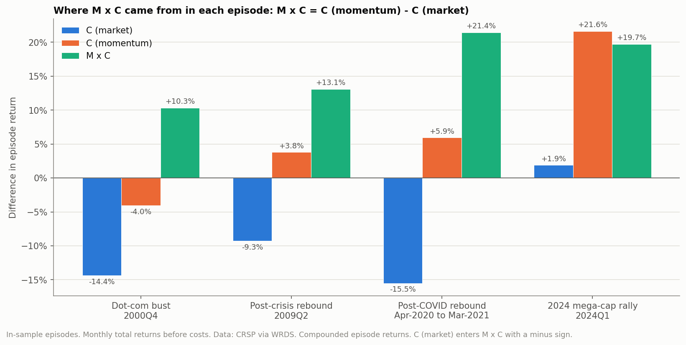
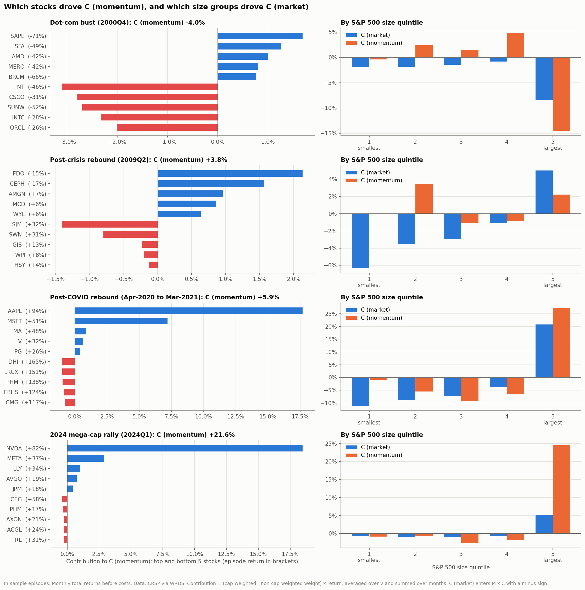

# M x C episodes

Generated by `scripts/05_episodes.py`. M x C = C (momentum) - C (market), the interaction found in [output/attribution](../attribution/summary.md). The episodes are the three largest |M x C| quarters and the post-COVID rebound, all in-sample. Portfolio codes and formulas as in the attribution summary; returns before costs.

## Overview

Episode values compound each portfolio's monthly returns over the episode and then apply the effect formula.

| Episode | Rebalances held | `010` S&P 500 cap weight | `000` S&P 500 equal weight | C (market) | C (momentum) | M x C |
|---|---|---|---|---|---|---|
| Dot-com bust (2000Q4) | Aug-2000 | -9.6% | 4.9% | -14.4% | -4.0% | 10.3% |
| Post-crisis rebound (2009Q2) | Feb-2009 | 15.3% | 25.8% | -9.3% | 3.8% | 13.1% |
| Post-COVID rebound (Apr-2020 to Mar-2021) | Feb-2020, Aug-2020 | 56.3% | 74.1% | -15.5% | 5.9% | 21.4% |
| 2024 mega-cap rally (2024Q1) | Aug-2023 | 10.4% | 8.0% | 1.9% | 21.6% | 19.7% |

Contributions below are summed monthly contributions; their total equals the sum of the monthly effect, shown for comparison with the compounded value:

| Episode | C (market), sum of months | C (momentum), sum of months | M x C, sum of months |
|---|---|---|---|
| Dot-com bust | -14.5% | -6.1% | 8.5% |
| Post-crisis rebound | -8.9% | 3.7% | 12.6% |
| Post-COVID rebound | -10.1% | 5.0% | 15.1% |
| 2024 mega-cap rally | 1.7% | 18.6% | 16.8% |

## Dot-com bust (2000Q4)

Episode return of each portfolio:

| `000` | `001` | `010` | `011` | `100` | `101` | `110` | `111` |
|---|---|---|---|---|---|---|---|
| 4.9% | 7.6% | -9.6% | -6.6% | -28.5% | -22.9% | -31.2% | -28.3% |

C (market) -14.4%, C (momentum) -4.0%, M x C +10.3%.

**C (momentum): largest positive and negative contributors.** Weight difference is the cap-weighted minus the non-cap-weighted quintile weight, averaged over V and over the episode's months.

| Stock | Episode return | Avg. weight difference | Contribution |
|---|---|---|---|
| SAPE | -70.7% | -1.8% | 1.7% |
| SFA | -48.8% | -2.2% | 1.3% |
| AMD | -41.5% | -2.1% | 1.0% |
| MERQ | -42.4% | -1.7% | 0.8% |
| BRCM | -65.5% | -0.9% | 0.8% |
| NT | -46.1% | 5.5% | -3.1% |
| CSCO | -30.8% | 8.0% | -2.8% |
| SUNW | -52.2% | 4.3% | -2.7% |
| INTC | -27.6% | 7.4% | -2.3% |
| ORCL | -26.2% | 7.3% | -2.0% |

**C (market): largest positive and negative contributors.** A negative C (market) raises M x C.

| Stock | Episode return | Avg. weight difference | Contribution |
|---|---|---|---|
| MRK | 26.3% | 1.3% | 0.3% |
| BMY | 30.0% | 0.6% | 0.2% |
| MO | 51.4% | 0.4% | 0.2% |
| ACK | -82.7% | -0.1% | 0.2% |
| WMT | 10.5% | 1.5% | 0.2% |
| CSCO | -30.8% | 3.3% | -1.1% |
| INTC | -27.6% | 3.6% | -1.0% |
| GE | -16.6% | 4.9% | -0.9% |
| MSFT | -28.1% | 2.8% | -0.8% |
| NT | -46.1% | 1.2% | -0.7% |

**Contributions by size quintile.** Quintiles split the S&P 500 by average cap weight over the episode; C (market) is spread over many stocks, so it is best read here.

| S&P 500 size quintile | Stocks | Avg. return | C (market) contribution | C (momentum) contribution |
|---|---|---|---|---|
| 1 (smallest) | 99 | 9.6% | -1.9% | -0.4% |
| 2 | 99 | 9.1% | -1.9% | 2.4% |
| 3 | 99 | 8.1% | -1.5% | 1.5% |
| 4 | 99 | 3.0% | -0.8% | 4.9% |
| 5 (largest) | 99 | -6.0% | -8.4% | -14.5% |

**Largest holdings of `110` (momentum x market cap) at the start of the episode.**

| Stock | `110` weight | `100` weight | `010` weight | Episode return |
|---|---|---|---|---|
| ORCL | 11.3% | 2.7% | 2.0% | -26.2% |
| NT | 8.6% | 2.2% | 1.9% | -46.1% |
| CSCO | 8.1% | 1.0% | 3.8% | -30.8% |
| INTC | 7.0% | 0.9% | 3.8% | -27.6% |
| SUNW | 6.4% | 1.9% | 1.6% | -52.2% |

## Post-crisis rebound (2009Q2)

Episode return of each portfolio:

| `000` | `001` | `010` | `011` | `100` | `101` | `110` | `111` |
|---|---|---|---|---|---|---|---|
| 25.8% | 20.9% | 15.3% | 12.9% | 1.3% | 1.4% | 5.2% | 5.1% |

C (market) -9.3%, C (momentum) +3.8%, M x C +13.1%.

**C (momentum): largest positive and negative contributors.** Weight difference is the cap-weighted minus the non-cap-weighted quintile weight, averaged over V and over the episode's months.

| Stock | Episode return | Avg. weight difference | Contribution |
|---|---|---|---|
| FDO | -14.8% | -13.8% | 2.1% |
| CEPH | -16.8% | -8.7% | 1.6% |
| AMGN | 6.9% | 14.1% | 1.0% |
| MCD | 6.2% | 13.3% | 0.9% |
| WYE | 6.2% | 10.1% | 0.6% |
| SJM | 31.7% | -4.6% | -1.4% |
| SWN | 30.9% | -3.4% | -0.8% |
| GIS | 13.3% | -1.7% | -0.2% |
| WPI | 8.3% | -2.3% | -0.2% |
| HSY | 4.5% | -2.9% | -0.1% |

**C (market): largest positive and negative contributors.** A negative C (market) raises M x C.

| Stock | Episode return | Avg. weight difference | Contribution |
|---|---|---|---|
| MSFT | 30.2% | 2.0% | 0.5% |
| AAPL | 35.5% | 1.0% | 0.3% |
| WFC | 70.7% | 0.6% | 0.3% |
| JPM | 28.6% | 0.9% | 0.2% |
| PG | 9.5% | 2.5% | 0.2% |
| ODP | 248.1% | -0.3% | -0.3% |
| WYN | 189.6% | -0.3% | -0.3% |
| GNW | 267.9% | -0.2% | -0.3% |
| THC | 143.1% | -0.3% | -0.2% |
| AKS | 170.7% | -0.2% | -0.2% |

**Contributions by size quintile.** Quintiles split the S&P 500 by average cap weight over the episode; C (market) is spread over many stocks, so it is best read here.

| S&P 500 size quintile | Stocks | Avg. return | C (market) contribution | C (momentum) contribution |
|---|---|---|---|---|
| 1 (smallest) | 100 | 42.9% | -6.3% | 0.0% |
| 2 | 99 | 24.7% | -3.5% | 3.5% |
| 3 | 99 | 25.2% | -3.0% | -1.1% |
| 4 | 99 | 20.0% | -1.1% | -0.8% |
| 5 (largest) | 99 | 16.1% | 5.0% | 2.2% |

**Largest holdings of `110` (momentum x market cap) at the start of the episode.**

| Stock | `110` weight | `100` weight | `010` weight | Episode return |
|---|---|---|---|---|
| AMGN | 24.7% | 9.8% | 0.8% | 6.9% |
| MCD | 18.2% | 6.3% | 0.9% | 6.2% |
| WYE | 17.2% | 6.4% | 0.8% | 6.2% |
| GILD | 12.7% | 6.2% | 0.6% | 1.1% |
| GIS | 5.5% | 6.4% | 0.3% | 13.3% |

## Post-COVID rebound (Apr-2020 to Mar-2021)

Episode return of each portfolio:

| `000` | `001` | `010` | `011` | `100` | `101` | `110` | `111` |
|---|---|---|---|---|---|---|---|
| 74.1% | 63.8% | 56.3% | 50.6% | 49.3% | 43.3% | 54.7% | 49.8% |

C (market) -15.5%, C (momentum) +5.9%, M x C +21.4%.

**C (momentum): largest positive and negative contributors.** Weight difference is the cap-weighted minus the non-cap-weighted quintile weight, averaged over V and over the episode's months.

| Stock | Episode return | Avg. weight difference | Contribution |
|---|---|---|---|
| AAPL | 93.6% | 26.1% | 17.7% |
| MSFT | 51.0% | 14.6% | 7.2% |
| MA | 48.2% | 1.2% | 0.9% |
| V | 32.2% | 1.3% | 0.6% |
| PG | 26.2% | 0.8% | 0.4% |
| DHI | 165.1% | -0.8% | -1.0% |
| LRCX | 151.1% | -1.0% | -1.0% |
| PHM | 137.9% | -0.6% | -1.0% |
| FBHS | 124.4% | -0.9% | -0.8% |
| CMG | 117.1% | -0.9% | -0.8% |

**C (market): largest positive and negative contributors.** A negative C (market) raises M x C.

| Stock | Episode return | Avg. weight difference | Contribution |
|---|---|---|---|
| AAPL | 93.6% | 6.0% | 3.5% |
| MSFT | 51.0% | 5.2% | 2.2% |
| AMZN | 58.7% | 4.9% | 1.8% |
| GOOG | 77.9% | 1.7% | 1.1% |
| FB | 76.6% | 1.9% | 1.0% |
| KSS | 310.2% | -0.2% | -0.3% |
| LB | 435.1% | -0.2% | -0.3% |
| APA | 332.0% | -0.2% | -0.3% |
| COTY | 74.6% | -0.2% | -0.3% |
| MRO | 227.4% | -0.2% | -0.3% |

**Contributions by size quintile.** Quintiles split the S&P 500 by average cap weight over the episode; C (market) is spread over many stocks, so it is best read here.

| S&P 500 size quintile | Stocks | Avg. return | C (market) contribution | C (momentum) contribution |
|---|---|---|---|---|
| 1 (smallest) | 103 | 101.2% | -11.0% | -0.9% |
| 2 | 102 | 77.8% | -8.9% | -5.5% |
| 3 | 102 | 74.7% | -7.2% | -9.3% |
| 4 | 102 | 65.5% | -3.9% | -6.7% |
| 5 (largest) | 103 | 56.4% | 20.9% | 27.4% |

**Largest holdings of `110` (momentum x market cap) at the start of the episode.**

| Stock | `110` weight | `100` weight | `010` weight | Episode return |
|---|---|---|---|---|
| AAPL | 26.1% | 1.8% | 4.7% | 93.6% |
| MSFT | 19.8% | 1.3% | 4.9% | 51.0% |
| V | 3.7% | 1.0% | 1.2% | 32.2% |
| MA | 3.6% | 1.0% | 1.1% | 48.2% |
| PG | 2.2% | 0.7% | 1.1% | 26.2% |

## 2024 mega-cap rally (2024Q1)

Episode return of each portfolio:

| `000` | `001` | `010` | `011` | `100` | `101` | `110` | `111` |
|---|---|---|---|---|---|---|---|
| 8.0% | 7.9% | 10.4% | 9.2% | 15.4% | 15.0% | 40.9% | 32.7% |

C (market) +1.9%, C (momentum) +21.6%, M x C +19.7%.

**C (momentum): largest positive and negative contributors.** Weight difference is the cap-weighted minus the non-cap-weighted quintile weight, averaged over V and over the episode's months.

| Stock | Episode return | Avg. weight difference | Contribution |
|---|---|---|---|
| NVDA | 82.5% | 28.0% | 18.5% |
| META | 37.3% | 8.4% | 2.9% |
| LLY | 33.7% | 3.4% | 1.0% |
| AVGO | 19.2% | 4.0% | 0.7% |
| JPM | 18.5% | 2.6% | 0.4% |
| CEG | 58.5% | -0.8% | -0.4% |
| PHM | 17.1% | -2.0% | -0.3% |
| AXON | 21.1% | -1.3% | -0.3% |
| ACGL | 24.5% | -1.1% | -0.2% |
| RL | 30.7% | -0.8% | -0.2% |

**C (market): largest positive and negative contributors.** A negative C (market) raises M x C.

| Stock | Episode return | Avg. weight difference | Contribution |
|---|---|---|---|
| NVDA | 82.5% | 2.8% | 1.8% |
| MSFT | 12.1% | 6.3% | 0.7% |
| AMZN | 18.7% | 3.3% | 0.6% |
| META | 37.3% | 1.3% | 0.4% |
| LLY | 33.7% | 1.3% | 0.4% |
| AAPL | -10.8% | 6.9% | -0.8% |
| TSLA | -29.3% | 1.0% | -0.4% |
| CEG | 58.5% | -0.1% | -0.1% |
| NRG | 31.9% | -0.2% | -0.1% |
| RL | 30.7% | -0.2% | -0.1% |

**Contributions by size quintile.** Quintiles split the S&P 500 by average cap weight over the episode; C (market) is spread over many stocks, so it is best read here.

| S&P 500 size quintile | Stocks | Avg. return | C (market) contribution | C (momentum) contribution |
|---|---|---|---|---|
| 1 (smallest) | 101 | 4.5% | -0.7% | -0.8% |
| 2 | 100 | 6.6% | -1.0% | -0.7% |
| 3 | 100 | 8.2% | -1.0% | -2.6% |
| 4 | 100 | 10.6% | -0.8% | -1.9% |
| 5 (largest) | 100 | 9.5% | 5.3% | 24.6% |

**Largest holdings of `110` (momentum x market cap) at the start of the episode.**

| Stock | `110` weight | `100` weight | `010` weight | Episode return |
|---|---|---|---|---|
| NVDA | 33.4% | 3.3% | 3.2% | 82.5% |
| META | 11.9% | 2.2% | 1.8% | 37.3% |
| AVGO | 5.7% | 1.8% | 1.2% | 19.2% |
| NFLX | 3.6% | 2.3% | 0.6% | 24.7% |
| LLY | 3.5% | 0.8% | 1.3% | 33.7% |

## Figures

