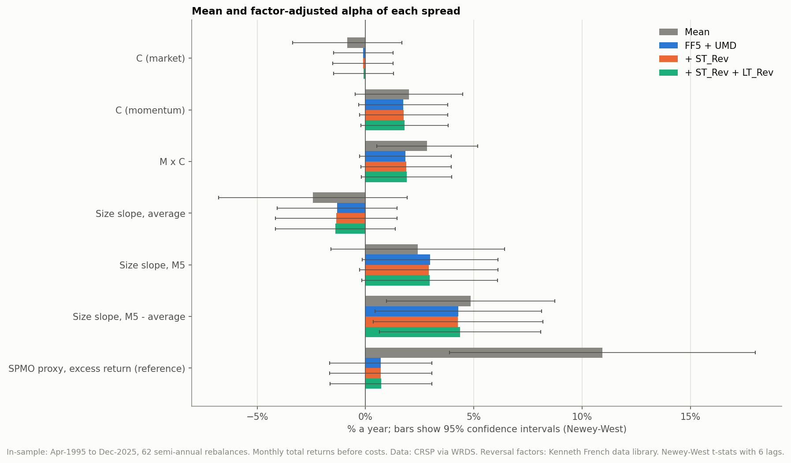
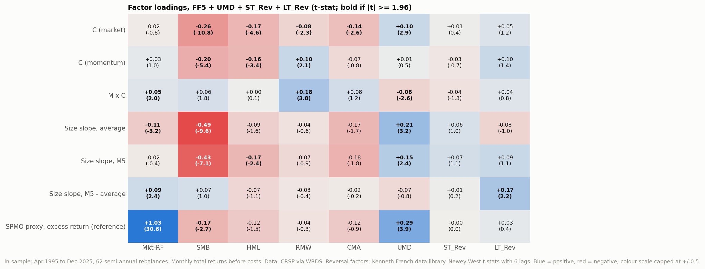
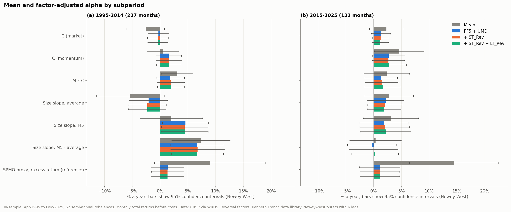
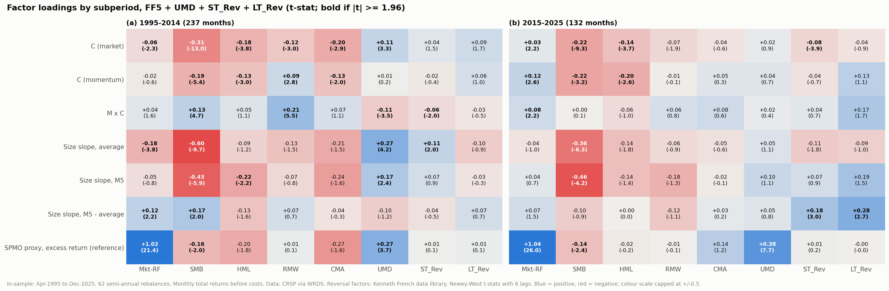

# Factor regressions of the market-cap effects

Generated by `scripts/07_factor_regressions.py`. In-sample only: Apr-1995 to Dec-2025, monthly. Spreads are regressed without subtracting the risk-free rate; the SPMO proxy row uses its excess return. t-stats are Newey-West with 6 lags. Reversal factors are from the Kenneth French data library; the other factors from WRDS.

Dependent variables: C (market), C (momentum) and M x C as defined in [output/attribution](../attribution/summary.md); size slopes (S5 - S1) from [output/double_sort](../double_sort/summary.md).

## Mean and alpha under each specification

Annualised, % a year, t-stat in brackets.

| Dependent | Mean | FF5 + UMD | + ST_Rev | + ST_Rev + LT_Rev |
|---|---|---|---|---|
| C (market) | -0.8% (-0.65) | -0.1% (-0.15) | -0.1% (-0.16) | -0.1% (-0.13) |
| C (momentum) | +2.0% (1.58) | +1.7% (1.65) | +1.8% (1.69) | +1.8% (1.76) |
| M x C | +2.8% (2.39) | +1.8% (1.71) | +1.9% (1.76) | +1.9% (1.78) |
| Size slope, average (current size) | -2.4% (-1.10) | -1.3% (-0.93) | -1.4% (-0.95) | -1.4% (-0.99) |
| Size slope, M5 (current size) | +2.4% (1.18) | +3.0% (1.87) | +2.9% (1.79) | +3.0% (1.86) |
| Size slope, M5 - average (current size) | +4.9% (2.45) | +4.3% (2.19) | +4.3% (2.14) | +4.4% (2.29) |
| Size slope, M5 - average (lagged size) | +2.4% (1.28) | +1.2% (0.62) | +1.2% (0.58) | +1.2% (0.60) |
| SPMO proxy, excess return (reference) | +10.9% (3.03) | +0.7% (0.58) | +0.7% (0.58) | +0.7% (0.60) |

## Factor premia

The factors themselves over the same months: annualised mean (Newey-West t) and Sharpe ratio. Factors are long-short returns, so the Sharpe ratio uses no risk-free rate.

| Factor | Full period: mean (t) | Full period: Sharpe | 1995-2014: mean (t) | 1995-2014: Sharpe | 2015-2025: mean (t) | 2015-2025: Sharpe |
|---|---|---|---|---|---|---|
| Mkt-RF | +9.3% (3.29) | 0.60 | +7.9% (2.03) | 0.51 | +11.9% (3.26) | 0.77 |
| SMB | +0.8% (0.43) | 0.07 | +2.6% (1.15) | 0.23 | -2.5% (-0.83) | -0.25 |
| HML | +1.6% (0.64) | 0.14 | +3.3% (1.10) | 0.30 | -1.4% (-0.30) | -0.11 |
| RMW | +4.0% (2.12) | 0.42 | +4.4% (1.62) | 0.41 | +3.3% (1.60) | 0.45 |
| CMA | +1.9% (1.25) | 0.25 | +3.8% (2.07) | 0.51 | -1.4% (-0.53) | -0.17 |
| UMD | +4.3% (1.40) | 0.26 | +5.5% (1.26) | 0.30 | +2.2% (0.61) | 0.16 |
| ST_Rev | +2.1% (1.08) | 0.16 | +3.2% (1.25) | 0.23 | +0.2% (0.06) | 0.02 |
| LT_Rev | +0.7% (0.35) | 0.07 | +2.6% (1.22) | 0.30 | -2.7% (-0.72) | -0.25 |

## Coefficients: FF5 + UMD

Loadings with t-stats in brackets.

| Dependent | Alpha, % a year (t) | Mkt-RF | SMB | HML | RMW | CMA | UMD | R2 |
|---|---|---|---|---|---|---|---|---|
| C (market) | -0.1% (-0.15) | -0.01 (-0.6) | -0.25 (-11.1) | -0.15 (-4.3) | -0.09 (-2.9) | -0.12 (-2.7) | +0.10 (3.1) | 0.61 |
| C (momentum) | +1.7% (1.65) | +0.03 (1.0) | -0.18 (-5.2) | -0.14 (-2.9) | +0.07 (1.5) | -0.01 (-0.2) | +0.02 (0.9) | 0.20 |
| M x C | +1.8% (1.71) | +0.04 (1.8) | +0.07 (2.3) | +0.01 (0.4) | +0.16 (3.3) | +0.11 (2.0) | -0.07 (-2.2) | 0.17 |
| Size slope, average (current size) | -1.3% (-0.93) | -0.10 (-3.3) | -0.51 (-10.6) | -0.11 (-2.0) | -0.01 (-0.2) | -0.22 (-2.6) | +0.20 (3.0) | 0.58 |
| Size slope, M5 (current size) | +3.0% (1.87) | -0.00 (-0.0) | -0.40 (-6.6) | -0.12 (-1.9) | -0.09 (-1.3) | -0.16 (-1.6) | +0.14 (2.5) | 0.27 |
| Size slope, M5 - average (current size) | +4.3% (2.19) | +0.10 (2.3) | +0.11 (1.8) | -0.01 (-0.2) | -0.08 (-1.1) | +0.06 (0.7) | -0.06 (-0.8) | 0.09 |
| Size slope, M5 - average (lagged size) | +1.2% (0.62) | +0.01 (0.2) | +0.02 (0.3) | +0.04 (0.6) | +0.18 (1.8) | +0.17 (1.9) | -0.02 (-0.3) | 0.08 |
| SPMO proxy, excess return (reference) | +0.7% (0.58) | +1.03 (32.1) | -0.17 (-2.4) | -0.10 (-1.3) | -0.04 (-0.5) | -0.10 (-0.8) | +0.29 (3.9) | 0.82 |

## Coefficients: + ST_Rev

Loadings with t-stats in brackets.

| Dependent | Alpha, % a year (t) | Mkt-RF | SMB | HML | RMW | CMA | UMD | ST_Rev | R2 |
|---|---|---|---|---|---|---|---|---|---|
| C (market) | -0.1% (-0.16) | -0.01 (-0.7) | -0.25 (-11.3) | -0.15 (-4.2) | -0.10 (-2.8) | -0.12 (-2.7) | +0.10 (3.1) | +0.01 (0.6) | 0.61 |
| C (momentum) | +1.8% (1.69) | +0.03 (1.1) | -0.18 (-5.3) | -0.13 (-2.8) | +0.07 (1.5) | -0.02 (-0.3) | +0.02 (0.7) | -0.02 (-0.6) | 0.20 |
| M x C | +1.9% (1.76) | +0.05 (2.0) | +0.07 (2.4) | +0.02 (0.5) | +0.17 (3.3) | +0.10 (1.8) | -0.08 (-2.5) | -0.04 (-1.3) | 0.18 |
| Size slope, average (current size) | -1.4% (-0.95) | -0.11 (-3.2) | -0.51 (-10.3) | -0.12 (-2.1) | -0.02 (-0.3) | -0.20 (-2.4) | +0.21 (3.1) | +0.06 (1.0) | 0.58 |
| Size slope, M5 (current size) | +2.9% (1.79) | -0.02 (-0.3) | -0.40 (-6.7) | -0.13 (-2.1) | -0.10 (-1.4) | -0.14 (-1.4) | +0.16 (2.6) | +0.08 (1.3) | 0.27 |
| Size slope, M5 - average (current size) | +4.3% (2.14) | +0.09 (2.4) | +0.11 (1.7) | -0.01 (-0.2) | -0.08 (-1.1) | +0.06 (0.7) | -0.05 (-0.6) | +0.02 (0.3) | 0.09 |
| Size slope, M5 - average (lagged size) | +1.2% (0.58) | -0.01 (-0.1) | +0.01 (0.2) | +0.03 (0.5) | +0.17 (1.8) | +0.19 (2.2) | -0.01 (-0.1) | +0.07 (1.2) | 0.09 |
| SPMO proxy, excess return (reference) | +0.7% (0.58) | +1.03 (30.8) | -0.17 (-2.4) | -0.10 (-1.3) | -0.05 (-0.5) | -0.10 (-0.8) | +0.29 (3.9) | +0.00 (0.0) | 0.82 |

## Coefficients: + ST_Rev + LT_Rev

Loadings with t-stats in brackets.

| Dependent | Alpha, % a year (t) | Mkt-RF | SMB | HML | RMW | CMA | UMD | ST_Rev | LT_Rev | R2 |
|---|---|---|---|---|---|---|---|---|---|---|
| C (market) | -0.1% (-0.13) | -0.02 (-0.8) | -0.26 (-10.8) | -0.17 (-4.6) | -0.08 (-2.3) | -0.14 (-2.6) | +0.10 (2.9) | +0.01 (0.4) | +0.05 (1.2) | 0.61 |
| C (momentum) | +1.8% (1.76) | +0.03 (1.0) | -0.20 (-5.4) | -0.16 (-3.4) | +0.10 (2.1) | -0.07 (-0.8) | +0.01 (0.5) | -0.03 (-0.7) | +0.10 (1.4) | 0.21 |
| M x C | +1.9% (1.78) | +0.05 (2.0) | +0.06 (1.8) | +0.00 (0.1) | +0.18 (3.8) | +0.08 (1.2) | -0.08 (-2.6) | -0.04 (-1.3) | +0.04 (0.8) | 0.18 |
| Size slope, average (current size) | -1.4% (-0.99) | -0.11 (-3.2) | -0.49 (-9.6) | -0.09 (-1.6) | -0.04 (-0.6) | -0.17 (-1.7) | +0.21 (3.2) | +0.06 (1.0) | -0.08 (-1.0) | 0.58 |
| Size slope, M5 (current size) | +3.0% (1.86) | -0.02 (-0.4) | -0.43 (-7.1) | -0.17 (-2.4) | -0.07 (-0.9) | -0.18 (-1.8) | +0.15 (2.4) | +0.07 (1.1) | +0.09 (1.1) | 0.28 |
| Size slope, M5 - average (current size) | +4.4% (2.29) | +0.09 (2.4) | +0.07 (1.0) | -0.07 (-1.1) | -0.03 (-0.4) | -0.02 (-0.2) | -0.07 (-0.8) | +0.01 (0.2) | +0.17 (2.2) | 0.10 |
| Size slope, M5 - average (lagged size) | +1.2% (0.60) | -0.01 (-0.2) | +0.00 (0.1) | +0.02 (0.3) | +0.19 (2.0) | +0.17 (1.7) | -0.01 (-0.2) | +0.07 (1.1) | +0.05 (0.6) | 0.09 |
| SPMO proxy, excess return (reference) | +0.7% (0.60) | +1.03 (30.6) | -0.17 (-2.7) | -0.12 (-1.5) | -0.04 (-0.3) | -0.12 (-0.9) | +0.29 (3.9) | +0.00 (0.0) | +0.03 (0.4) | 0.82 |

## Subperiod 1995-2014 (237 months)

Mean and alpha under each specification (% a year, t-stat):

| Dependent | Mean | FF5 + UMD | + ST_Rev | + ST_Rev + LT_Rev |
|---|---|---|---|---|
| C (market) | -2.6% (-1.49) | -0.3% (-0.30) | -0.4% (-0.40) | -0.4% (-0.43) |
| C (momentum) | +0.5% (0.37) | +1.6% (1.34) | +1.6% (1.36) | +1.6% (1.42) |
| M x C | +3.1% (2.18) | +1.8% (1.43) | +2.0% (1.61) | +2.0% (1.59) |
| Size slope, average (current size) | -5.3% (-1.72) | -2.1% (-1.18) | -2.3% (-1.31) | -2.3% (-1.32) |
| Size slope, M5 (current size) | +2.0% (0.71) | +4.6% (2.16) | +4.4% (2.07) | +4.4% (2.06) |
| Size slope, M5 - average (current size) | +7.4% (2.75) | +6.7% (2.77) | +6.7% (2.74) | +6.7% (2.81) |
| Size slope, M5 - average (lagged size) | +4.5% (1.80) | +1.9% (0.68) | +1.8% (0.65) | +1.8% (0.65) |
| SPMO proxy, excess return (reference) | +9.0% (1.76) | +1.4% (0.91) | +1.4% (0.91) | +1.4% (0.91) |

Coefficients, FF5 + UMD + ST_Rev + LT_Rev:

| Dependent | Alpha, % a year (t) | Mkt-RF | SMB | HML | RMW | CMA | UMD | ST_Rev | LT_Rev | R2 |
|---|---|---|---|---|---|---|---|---|---|---|
| C (market) | -0.4% (-0.43) | -0.06 (-2.3) | -0.31 (-13.0) | -0.18 (-3.8) | -0.12 (-3.0) | -0.20 (-2.9) | +0.11 (3.3) | +0.04 (1.5) | +0.09 (1.7) | 0.65 |
| C (momentum) | +1.6% (1.42) | -0.02 (-0.6) | -0.19 (-5.4) | -0.13 (-3.0) | +0.09 (2.8) | -0.13 (-2.0) | +0.01 (0.2) | -0.02 (-0.4) | +0.06 (1.0) | 0.26 |
| M x C | +2.0% (1.59) | +0.04 (1.6) | +0.13 (4.7) | +0.05 (1.1) | +0.21 (5.5) | +0.07 (1.1) | -0.11 (-3.5) | -0.06 (-2.0) | -0.03 (-0.5) | 0.34 |
| Size slope, average (current size) | -2.3% (-1.32) | -0.18 (-3.8) | -0.60 (-9.7) | -0.09 (-1.2) | -0.13 (-1.5) | -0.21 (-1.5) | +0.27 (4.2) | +0.11 (2.0) | -0.10 (-0.9) | 0.64 |
| Size slope, M5 (current size) | +4.4% (2.06) | -0.05 (-0.8) | -0.43 (-5.9) | -0.22 (-2.2) | -0.07 (-0.8) | -0.24 (-1.6) | +0.17 (2.4) | +0.07 (0.9) | -0.03 (-0.3) | 0.33 |
| Size slope, M5 - average (current size) | +6.7% (2.81) | +0.12 (2.2) | +0.17 (2.0) | -0.13 (-1.6) | +0.07 (0.7) | -0.04 (-0.3) | -0.10 (-1.2) | -0.04 (-0.5) | +0.07 (0.7) | 0.12 |
| Size slope, M5 - average (lagged size) | +1.8% (0.65) | +0.06 (0.9) | +0.09 (1.3) | -0.04 (-0.4) | +0.32 (2.8) | +0.24 (1.7) | -0.03 (-0.6) | +0.02 (0.3) | -0.03 (-0.3) | 0.11 |
| SPMO proxy, excess return (reference) | +1.4% (0.91) | +1.02 (21.4) | -0.16 (-2.0) | -0.20 (-1.8) | +0.01 (0.1) | -0.27 (-1.6) | +0.27 (3.7) | +0.01 (0.1) | +0.01 (0.1) | 0.82 |

## Subperiod 2015-2025 (132 months)

Mean and alpha under each specification (% a year, t-stat):

| Dependent | Mean | FF5 + UMD | + ST_Rev | + ST_Rev + LT_Rev |
|---|---|---|---|---|
| C (market) | +2.3% (1.48) | +1.3% (1.52) | +1.2% (1.63) | +1.2% (1.61) |
| C (momentum) | +4.6% (2.04) | +2.7% (1.79) | +2.7% (1.81) | +2.8% (1.77) |
| M x C | +2.3% (1.12) | +1.4% (0.91) | +1.4% (0.95) | +1.6% (0.99) |
| Size slope, average (current size) | +2.8% (1.26) | +2.2% (1.26) | +2.0% (1.24) | +1.9% (1.23) |
| Size slope, M5 (current size) | +3.1% (1.24) | +1.9% (0.84) | +2.0% (0.87) | +2.2% (0.93) |
| Size slope, M5 - average (current size) | +0.3% (0.14) | -0.3% (-0.13) | +0.0% (0.00) | +0.3% (0.12) |
| Size slope, M5 - average (lagged size) | -1.5% (-0.68) | -1.2% (-0.51) | -0.9% (-0.39) | -0.7% (-0.33) |
| SPMO proxy, excess return (reference) | +14.5% (3.54) | +1.1% (0.60) | +1.1% (0.61) | +1.1% (0.61) |

Coefficients, FF5 + UMD + ST_Rev + LT_Rev:

| Dependent | Alpha, % a year (t) | Mkt-RF | SMB | HML | RMW | CMA | UMD | ST_Rev | LT_Rev | R2 |
|---|---|---|---|---|---|---|---|---|---|---|
| C (market) | +1.2% (1.61) | +0.03 (2.2) | -0.22 (-9.3) | -0.14 (-3.7) | -0.07 (-1.9) | -0.04 (-0.6) | +0.02 (0.9) | -0.08 (-3.9) | -0.04 (-0.9) | 0.69 |
| C (momentum) | +2.8% (1.77) | +0.12 (2.6) | -0.22 (-3.2) | -0.20 (-2.6) | -0.01 (-0.1) | +0.05 (0.3) | +0.04 (0.7) | -0.04 (-0.7) | +0.13 (1.1) | 0.22 |
| M x C | +1.6% (0.99) | +0.08 (2.2) | +0.00 (0.1) | -0.06 (-1.0) | +0.06 (0.8) | +0.08 (0.6) | +0.02 (0.4) | +0.04 (0.7) | +0.17 (1.7) | 0.14 |
| Size slope, average (current size) | +1.9% (1.23) | -0.04 (-1.0) | -0.36 (-6.3) | -0.14 (-1.8) | -0.06 (-0.9) | -0.05 (-0.6) | +0.05 (1.1) | -0.11 (-1.8) | -0.09 (-1.0) | 0.60 |
| Size slope, M5 (current size) | +2.2% (0.93) | +0.04 (0.7) | -0.46 (-4.2) | -0.14 (-1.4) | -0.18 (-1.3) | -0.02 (-0.1) | +0.10 (1.1) | +0.07 (0.9) | +0.19 (1.5) | 0.27 |
| Size slope, M5 - average (current size) | +0.3% (0.12) | +0.07 (1.5) | -0.10 (-0.9) | +0.00 (0.0) | -0.12 (-1.1) | +0.03 (0.2) | +0.05 (0.8) | +0.18 (3.0) | +0.28 (2.7) | 0.24 |
| Size slope, M5 - average (lagged size) | -0.7% (-0.33) | -0.04 (-0.7) | -0.12 (-0.9) | +0.03 (0.4) | -0.03 (-0.2) | +0.12 (0.8) | +0.06 (0.9) | +0.20 (3.2) | +0.17 (1.5) | 0.17 |
| SPMO proxy, excess return (reference) | +1.1% (0.61) | +1.04 (26.0) | -0.14 (-2.4) | -0.02 (-0.2) | -0.01 (-0.1) | +0.14 (1.2) | +0.38 (7.7) | +0.01 (0.2) | -0.00 (-0.0) | 0.87 |

## Figures

