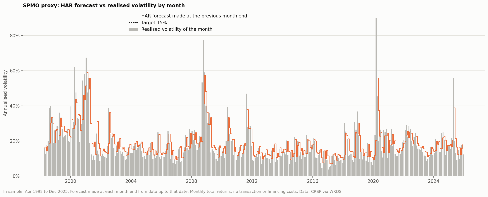
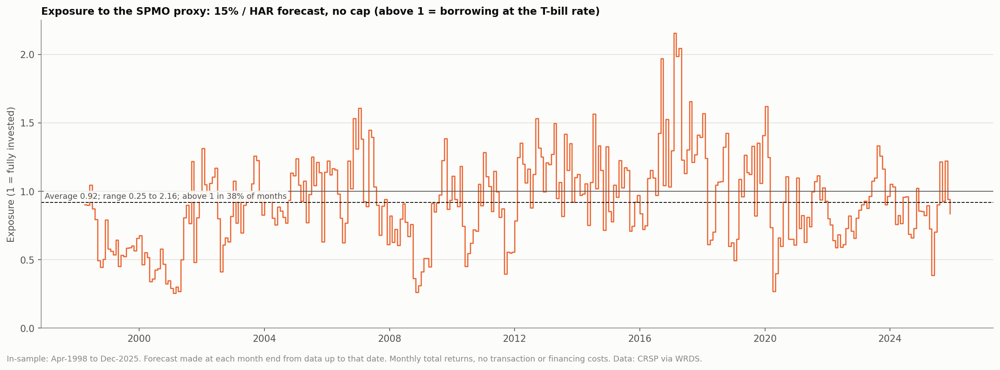
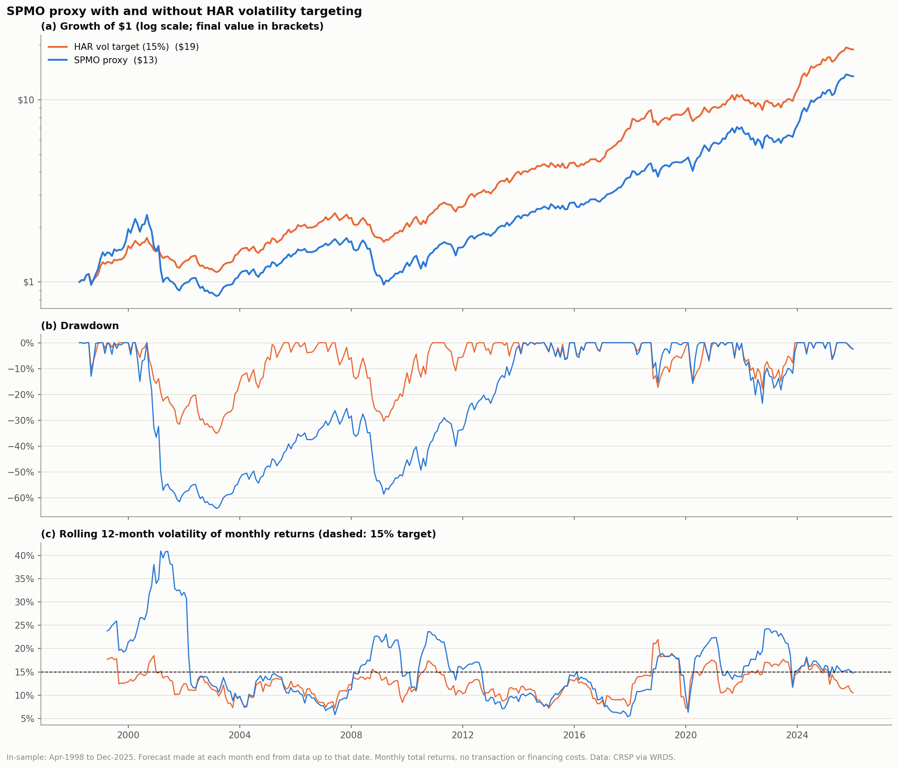
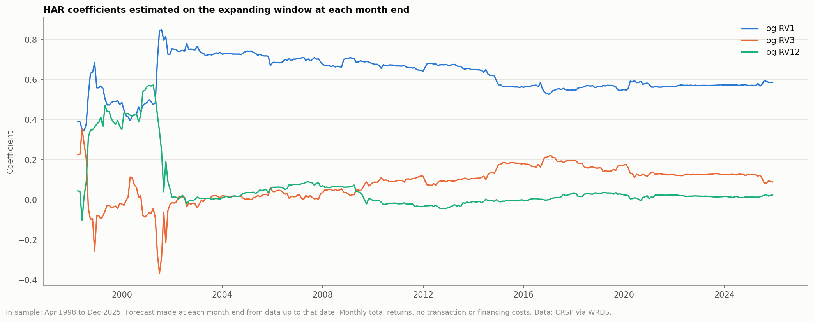
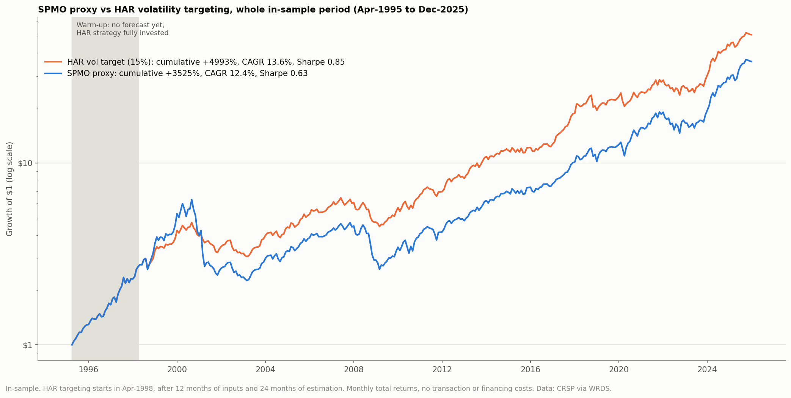

# HAR volatility targeting of the SPMO proxy

Generated by `scripts/08_har_vol_target.py`. In-sample only: Apr-1998 to Dec-2025 (333 months). No transaction or financing costs.

## Method

- Exposure for month m+1 = 15% / forecast of the proxy's realised volatility in m+1, with no cap. The remainder (or the borrowing, when exposure exceeds 1) earns the one-month T-bill rate.
- Forecast: HAR model in logs (Corsi 2009), log RV(m+1) = b0 + b1 log RV1(m) + b2 log RV3(m) + b3 log RV12(m), where RV1, RV3 and RV12 are annualised realised volatilities over the last 1, 3 and 12 calendar months, sqrt(252 x mean squared daily return). The forecast is exp(fitted + s^2/2).
- Coefficients are re-estimated each month on an expanding window of all pairs observed so far (at least 24), so forecasts use only data available at the time. Inputs start at the first in-sample holding month, so forecasting starts after 12 + 24 months.
- Daily proxy returns are rebuilt from the pipeline's start-of-month weights; compounded, they match the pipeline's monthly returns within 0.09% a month (delisting returns exist only monthly).

## Forecast accuracy

Out-of-sample over the forecast months: R^2 of the log forecast against the realised log volatility, mean log error (positive = realised above forecast) and RMSE in volatility units. The naive forecasts use the trailing realised volatility as the forecast.

| Forecast | R2 (log vol) | Mean error (log) | RMSE (vol) |
|---|---|---|---|
| HAR | 0.386 | -0.093 | 0.088 |
| Last month (RV1) | 0.328 | -0.001 | 0.095 |
| Last 3 months (RV3) | 0.227 | -0.062 | 0.104 |
| Last 12 months (RV12) | -0.101 | -0.158 | 0.116 |

Final coefficients (expanding window to Dec-2025): const -0.562, RV1 +0.586, RV3 +0.088, RV12 +0.024.

## Performance

Same months for both. Sharpe uses the T-bill rate. Sharpe difference z is the Jobson-Korkie test with Memmel's correction (|z| > 1.96 is significant at 5%).

### Full period

| Portfolio | CAGR | Volatility | Sharpe | Max drawdown | Avg exposure | Exposure range |
|---|---|---|---|---|---|---|
| SPMO proxy | 9.8% | 17.6% | 0.51 | -64.1% | 1.00 | 1.00-1.00 |
| HAR vol target (15%) | 11.2% | 13.2% | 0.72 | -35.1% | 0.92 | 0.25-2.16 |

Sharpe difference z: +2.55.

### Apr-1998 to Dec-2014

| Portfolio | CAGR | Volatility | Sharpe | Max drawdown | Avg exposure | Exposure range |
|---|---|---|---|---|---|---|
| SPMO proxy | 5.8% | 18.6% | 0.28 | -64.1% | 1.00 | 1.00-1.00 |
| HAR vol target (15%) | 9.2% | 12.6% | 0.59 | -35.1% | 0.88 | 0.25-1.61 |

Sharpe difference z: +2.90.

### Jan-2015 to Dec-2025

| Portfolio | CAGR | Volatility | Sharpe | Max drawdown | Avg exposure | Exposure range |
|---|---|---|---|---|---|---|
| SPMO proxy | 16.3% | 15.7% | 0.93 | -23.5% | 1.00 | 1.00-1.00 |
| HAR vol target (15%) | 14.3% | 14.1% | 0.89 | -17.7% | 0.98 | 0.27-2.16 |

Sharpe difference z: -0.32.

## Figures

## Reference

Corsi, F. (2009). A simple approximate long-memory model of realized volatility. *Journal of Financial Econometrics* 7(2), 174-196.
