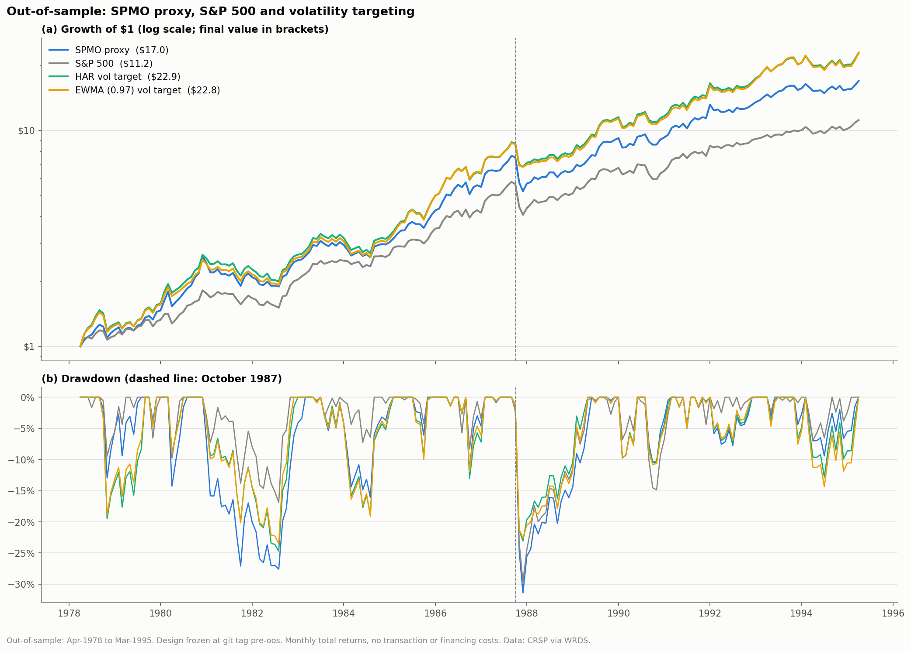
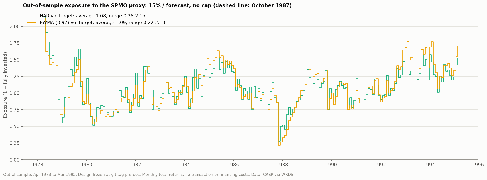
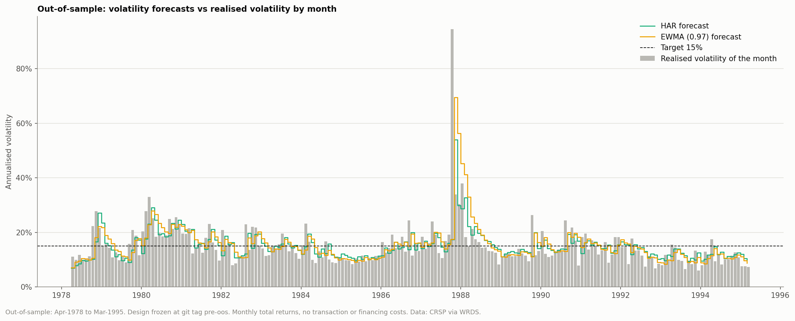
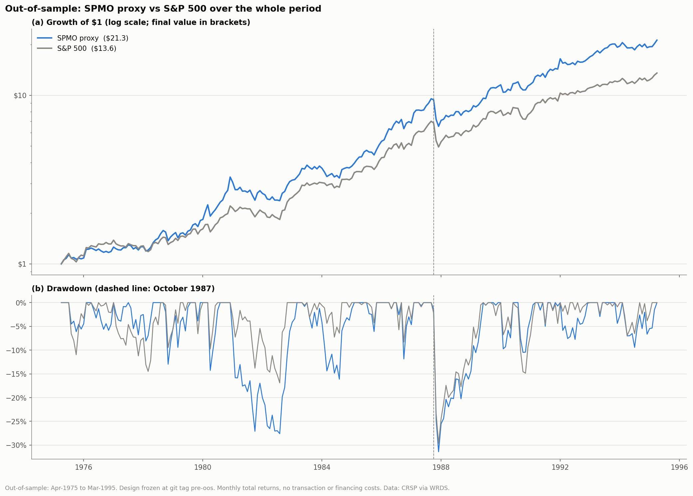

# Out-of-sample evaluation

Generated by `scripts/10_oos.py`. The design was frozen at git tag `pre-oos` before this evaluation was run; all settings are the in-sample ones. No transaction or financing costs.

## Setup

- SPMO proxy: capped version of `scripts/03_spmo_proxy.py`, rebalances with reference months Feb-1975 to Aug-1994.
- S&P 500: CRSP S&P 500 value-weighted index including dividends (vwretd).
- HAR and EWMA (0.97): as in scripts 08 and 09. HAR is re-estimated monthly on an expanding window of out-of-sample data only (12 months of inputs, then at least 24 pairs). Exposure = 15% / forecast, no cap, rest at the T-bill rate.
- Sharpe uses the T-bill rate. z is the Jobson-Korkie test with Memmel's correction (|z| > 1.96 is significant at 5%).

## Volatility targeting (Apr-1978 to Mar-1995, 204 months)

The months covered by both forecasts.

| Portfolio | CAGR | Volatility | Sharpe | Max drawdown | Avg exposure | Exposure range |
|---|---|---|---|---|---|---|
| SPMO proxy | 18.1% | 18.0% | 0.61 | -31.4% | 1.00 | 1.00-1.00 |
| S&P 500 | 15.3% | 15.1% | 0.53 | -29.6% | 1.00 | 1.00-1.00 |
| HAR vol target | 20.2% | 18.4% | 0.70 | -24.7% | 1.08 | 0.28-2.15 |
| EWMA (0.97) vol target | 20.2% | 18.4% | 0.70 | -23.5% | 1.09 | 0.22-2.13 |

| Comparison | Sharpe difference z |
|---|---|
| HAR vol target vs SPMO proxy | +1.23 |
| EWMA (0.97) vol target vs SPMO proxy | +1.15 |
| HAR vol target vs EWMA (0.97) vol target | -0.02 |
| SPMO proxy vs S&P 500 | +0.83 |
| HAR vol target vs S&P 500 | +1.52 |
| EWMA (0.97) vol target vs S&P 500 | +1.50 |

Forecast accuracy against the realised volatility of the month (R^2 of log forecasts; mean log error, positive = realised above forecast; RMSE in volatility units):

| Forecast | R2 (log vol) | Mean error (log) | RMSE (vol) |
|---|---|---|---|
| HAR | 0.251 | -0.038 | 0.071 |
| EWMA (0.97) | 0.212 | -0.047 | 0.078 |
| Last month (RV1) | 0.082 | 0.001 | 0.084 |

## SPMO proxy vs S&P 500 (Apr-1975 to Mar-1995, 240 months)

The whole out-of-sample period, including the months before the first HAR forecast.

| Portfolio | CAGR | Volatility | Sharpe | Max drawdown | Avg exposure | Exposure range |
|---|---|---|---|---|---|---|
| SPMO proxy | 16.5% | 17.2% | 0.57 | -31.4% | 1.00 | 1.00-1.00 |
| S&P 500 | 13.9% | 14.9% | 0.48 | -29.6% | 1.00 | 1.00-1.00 |

| Comparison | Sharpe difference z |
|---|---|
| SPMO proxy vs S&P 500 | +0.94 |

## Context

- The out-of-sample period overlaps the sample in which momentum was documented (Jegadeesh and Titman 1993) and falls in a strong-momentum regime (Hwang and Rubesam 2015). It tests this project's construction choices, not the existence of momentum.
- It includes the October 1987 crash, a one-month shock that a forecast made at the previous month end cannot anticipate.

## Figures

