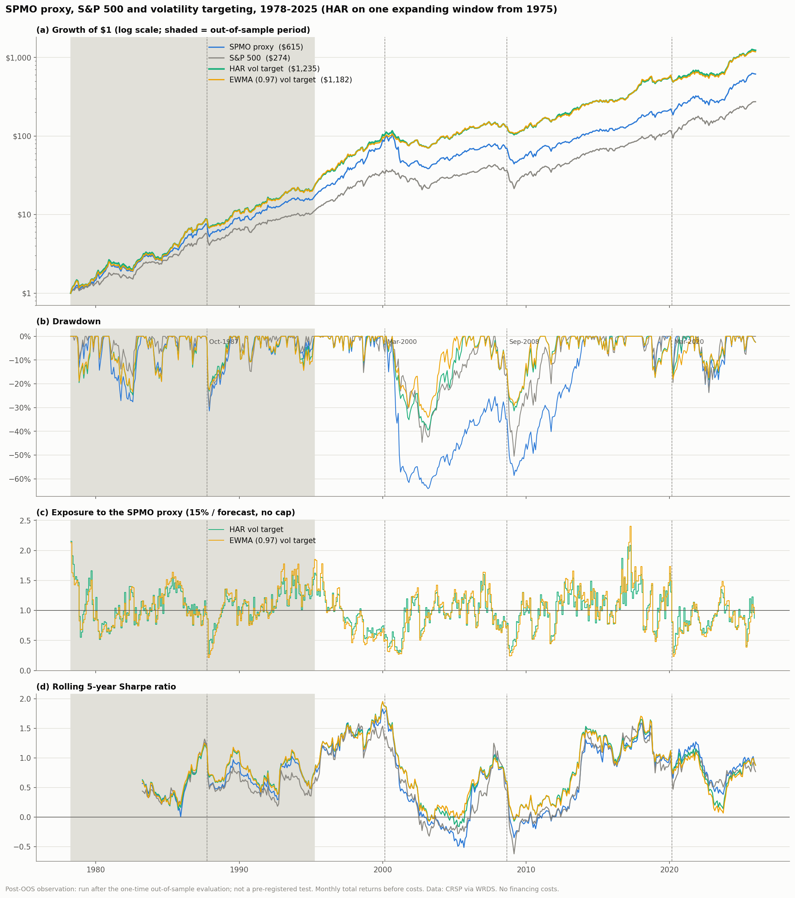
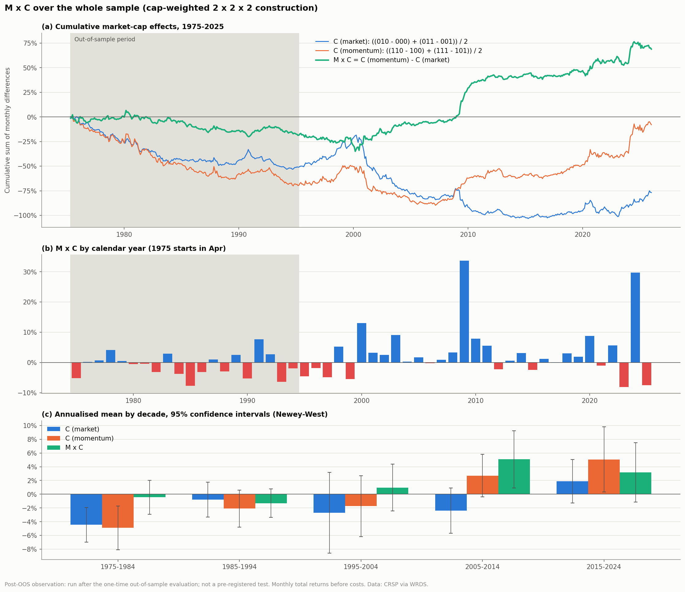

# Post-OOS observations

Generated by `scripts/11_post_oos.py`. **These analyses were run after the one-time out-of-sample evaluation (`scripts/10_oos.py`, design frozen at tag `pre-oos`). They are supplementary observations, not pre-registered tests.** Every setting is unchanged from the in-sample analysis. Returns before costs. t-stats are Newey-West with 6 lags.

## 1. The 2 x 2 x 2 attribution on the out-of-sample period (Apr-1975 to Mar-1995)

Portfolio 111 is uncapped by design; the capped SPMO proxy is shown for reference.

| Portfolio | CAGR | Sharpe |
|---|---|---|
| `000` S&P 500, equal weight | 16.5% | 0.58 |
| `001` S&P 500, 1 / sigma | 16.5% | 0.61 |
| `010` S&P 500, market cap | 13.9% | 0.48 |
| `011` S&P 500, market cap / sigma | 14.0% | 0.50 |
| `100` Top quintile, momentum | 20.8% | 0.72 |
| `101` Top quintile, momentum / sigma | 20.4% | 0.73 |
| `110` Top quintile, momentum x market cap | 17.1% | 0.58 |
| `111` Top quintile, momentum x market cap / sigma | 16.6% | 0.57 |
| SPMO proxy (capped) | 16.5% | 0.57 |
| S&P 500 (CRSP value-weighted index) | 13.9% | 0.48 |

| Effect | Description | Annualised mean (NW t) |
|---|---|---|
| M | momentum selection and weighting | +3.5% (2.13) |
| C | market-cap weighting | -3.0% (-3.22) |
| V | dividing weights by sigma | -0.3% (-1.05) |
| C (market) | C within the S&P 500 | -2.5% (-2.67) |
| C (momentum) | C within the momentum quintile | -3.5% (-3.22) |
| V (market) | V within the S&P 500 | -0.1% (-0.22) |
| V (momentum) | V within the momentum quintile | -0.6% (-1.54) |
| M x C | C (momentum) - C (market) | -0.9% (-1.14) |
| M x V | V (momentum) - V (market) | -0.5% (-1.84) |
| C x V | V with cap weighting - V without | +0.1% (0.33) |
| M x C x V | C x V in the momentum quintile - in the S&P 500 | -0.0% (-0.04) |
| M (equal weight) | 100 - 000 | +4.2% (2.34) |
| M (cap weight) | 110 - 010 | +3.3% (1.94) |

Factor means over the same months (% a year): Mkt-RF +7.6%, SMB +3.5%, HML +4.9%, RMW +3.6%, CMA +3.9%, UMD +10.2%.

Decomposition of the capped proxy's monthly excess return over the S&P 500: regression on FF5 + UMD; contribution = loading x factor mean.

| Term | Loading (NW t) | Contribution, % a year |
|---|---|---|
| Alpha |  | -0.8% (t -0.73) |
| Mkt-RF | -0.04 (-1.4) | -0.3% |
| SMB | +0.00 (0.1) | +0.0% |
| HML | -0.02 (-0.3) | -0.1% |
| RMW | -0.02 (-0.2) | -0.1% |
| CMA | -0.17 (-1.3) | -0.6% |
| UMD | +0.45 (9.1) | +4.6% |
| Total (mean excess over the S&P 500) | R^2 0.49 | +2.7% |

## 2. M x C over the whole sample

Cap-weighted 2 x 2 x 2 construction; annualised mean (Newey-West t).

| Period | Months | C (market) | C (momentum) | M x C |
|---|---|---|---|---|
| 1975-1994 (out-of-sample) | 237 | -2.6% (-2.70) | -3.5% (-3.19) | -0.9% (-1.07) |
| 1995-2014 | 240 | -2.5% (-1.48) | +0.5% (0.34) | +3.0% (2.13) |
| 2015-2025 | 132 | +2.3% (1.48) | +4.6% (2.04) | +2.3% (1.12) |
| 1995-2025 (in-sample) | 372 | -0.8% (-0.65) | +2.0% (1.56) | +2.8% (2.36) |
| 1975-2025 (whole sample) | 609 | -1.5% (-1.74) | -0.2% (-0.17) | +1.4% (1.67) |
| 1975-1984 | 117 | -4.4% (-3.46) | -4.9% (-3.00) | -0.4% (-0.35) |
| 1985-1994 | 120 | -0.8% (-0.61) | -2.1% (-1.52) | -1.3% (-1.24) |
| 1995-2004 | 120 | -2.7% (-0.90) | -1.7% (-0.76) | +1.0% (0.56) |
| 2005-2014 | 120 | -2.4% (-1.41) | +2.7% (1.71) | +5.1% (2.40) |
| 2015-2024 | 120 | +1.9% (1.17) | +5.1% (2.09) | +3.2% (1.43) |

## 3. Strategies over the whole sample

HAR is estimated on one expanding window from 1975, so its out-of-sample months equal those of `scripts/10_oos.py` (max abs difference 5.0e-07); its in-sample months differ slightly from `scripts/08_har_vol_target.py`, which uses in-sample data only. Sharpe difference z: Jobson-Korkie with Memmel's correction.

| Period | Portfolio | CAGR | Volatility | Sharpe | Max drawdown | Sharpe z vs proxy |
|---|---|---|---|---|---|---|
| Whole sample (Apr-1978 to Dec-2025) | SPMO proxy | 14.4% | 17.6% | 0.62 | -64.1% |  |
| Whole sample (Apr-1978 to Dec-2025) | S&P 500 | 12.5% | 15.1% | 0.58 | -50.5% |  |
| Whole sample (Apr-1978 to Dec-2025) | HAR vol target | 16.1% | 15.7% | 0.77 | -39.5% | +2.72 |
| Whole sample (Apr-1978 to Dec-2025) | EWMA (0.97) vol target | 16.0% | 15.6% | 0.77 | -34.1% | +2.38 |
| Out-of-sample part (Apr-1978 to Mar-1995) | SPMO proxy | 18.1% | 18.0% | 0.61 | -31.4% |  |
| Out-of-sample part (Apr-1978 to Mar-1995) | S&P 500 | 15.3% | 15.1% | 0.53 | -29.6% |  |
| Out-of-sample part (Apr-1978 to Mar-1995) | HAR vol target | 20.2% | 18.4% | 0.70 | -24.7% | +1.23 |
| Out-of-sample part (Apr-1978 to Mar-1995) | EWMA (0.97) vol target | 20.2% | 18.4% | 0.70 | -23.5% | +1.15 |
| 1995-2014 (Jan-1995 to Dec-2014) | SPMO proxy | 10.6% | 18.2% | 0.51 | -64.1% |  |
| 1995-2014 (Jan-1995 to Dec-2014) | S&P 500 | 9.9% | 15.1% | 0.53 | -50.5% |  |
| 1995-2014 (Jan-1995 to Dec-2014) | HAR vol target | 14.0% | 13.8% | 0.83 | -39.5% | +3.60 |
| 1995-2014 (Jan-1995 to Dec-2014) | EWMA (0.97) vol target | 14.1% | 13.4% | 0.86 | -34.1% | +3.32 |
| 2015-2025 (Jan-2015 to Dec-2025) | SPMO proxy | 16.3% | 15.7% | 0.93 | -23.5% |  |
| 2015-2025 (Jan-2015 to Dec-2025) | S&P 500 | 13.6% | 15.0% | 0.80 | -23.7% |  |
| 2015-2025 (Jan-2015 to Dec-2025) | HAR vol target | 14.5% | 14.5% | 0.89 | -18.2% | -0.37 |
| 2015-2025 (Jan-2015 to Dec-2025) | EWMA (0.97) vol target | 14.1% | 14.7% | 0.85 | -17.9% | -0.62 |

Sharpe ratio by decade:

| Decade | SPMO proxy | S&P 500 | HAR vol target | EWMA (0.97) vol target |
|---|---|---|---|---|
| 1980s | 0.60 | 0.55 | 0.70 | 0.70 |
| 1990s | 1.19 | 0.97 | 1.19 | 1.16 |
| 2000s | -0.26 | -0.14 | 0.04 | 0.11 |
| 2010s | 1.03 | 1.04 | 1.16 | 1.15 |
| 2020s | 0.92 | 0.76 | 0.77 | 0.70 |

## Figures

