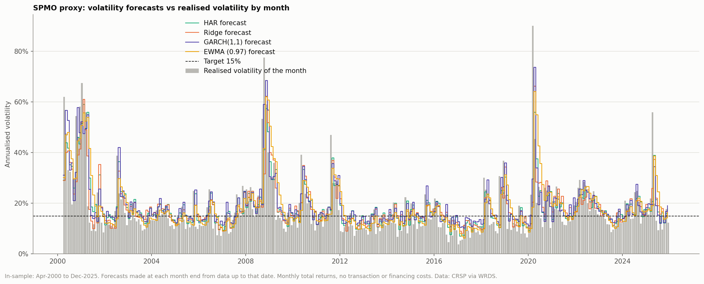
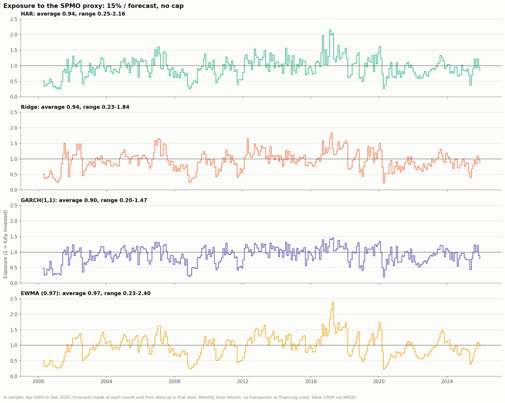
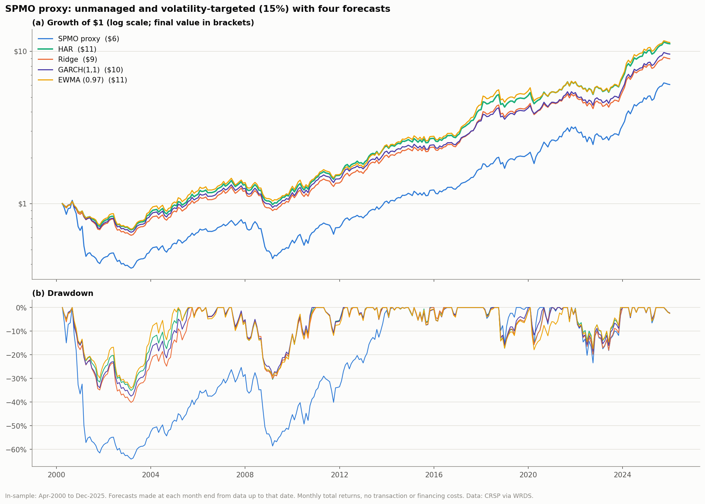
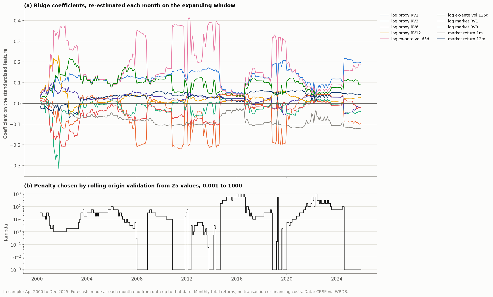
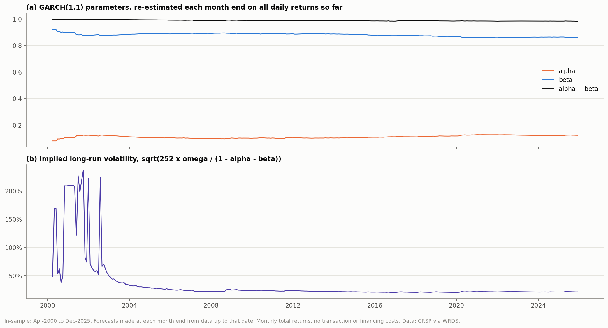

# Volatility targeting of the SPMO proxy: four forecasting models

Generated by `scripts/09_vol_model_comparison.py`. In-sample only: Apr-2000 to Dec-2025 (309 months), the months covered by all four forecasts. No transaction or financing costs.

## Method

- Exposure for month m+1 = 15% / forecast of the proxy's realised volatility in m+1, set at the end of m, no cap; the rest (or the borrowing) at the T-bill rate. Same rule for every model.
- **HAR**: `scripts/08_har_vol_target.py`, log HAR on 1, 3 and 12-month realised volatility.
- **Ridge**: log RV(m+1) on ten features known at the end of m (log proxy RV over 1, 3, 6 and 12 months; log ex-ante volatility of the next month's weights over the constituents' last 63 and 126 daily returns; log S&P 500 RV over 1 and 3 months; S&P 500 return over 1 and 12 months). Features standardised on the training window; lambda from 25 log-spaced values (0.001 to 1000) by rolling-origin validation over the last 24 months; forecast exp(fitted + s^2/2).
- **GARCH(1,1)**: Gaussian, constant mean, on the proxy's daily returns; re-estimated each month end by maximum likelihood on all daily returns so far (at least 504). Forecast = average conditional variance over the next 21 trading days, annualised.
- **EWMA (0.97)**: sigma^2_t = 0.97 sigma^2_(t-1) + 0.03 r^2_(t-1) on daily returns (RiskMetrics, zero mean), taken at the month end and annualised; no parameters estimated.

## Forecast accuracy

Against the realised volatility of the next calendar month. R^2 of log forecasts; mean log error (positive = realised above forecast); RMSE in volatility units.

| Forecast | R2 (log vol) | Mean error (log) | RMSE (vol) |
|---|---|---|---|
| HAR | 0.353 | -0.102 | 0.088 |
| Ridge | 0.403 | -0.100 | 0.087 |
| GARCH(1,1) | 0.379 | -0.139 | 0.085 |
| EWMA (0.97) | 0.264 | -0.086 | 0.097 |
| Last month (RV1) | 0.295 | -0.003 | 0.096 |

Diebold-Mariano comparison with HAR on squared log errors (negative = model more accurate than HAR; Newey-West t, 6 lags):

| Comparison | Mean loss difference | t-stat |
|---|---|---|
| Ridge vs HAR | -0.0122 | -1.62 |
| GARCH(1,1) vs HAR | -0.0063 | -0.94 |
| EWMA (0.97) vs HAR | +0.0217 | 1.97 |

Final ridge coefficients (Dec-2025, lambda 0.001): log proxy RV1 +0.196, log proxy RV3 -0.098, log proxy RV6 -0.040, log proxy RV12 +0.029, log ex-ante vol 63d +0.189, log ex-ante vol 126d +0.093, log market RV1 -0.018, log market RV3 -0.021, market return 1m -0.120, market return 12m +0.042.

Final GARCH(1,1) estimates: alpha 0.122, beta 0.862, persistence 0.985, long-run volatility 21.3%.

## Performance

Sharpe uses the T-bill rate. z is the Jobson-Korkie test with Memmel's correction (|z| > 1.96 is significant at 5%).

### Common period

| Portfolio | CAGR | Volatility | Sharpe | Max drawdown | Avg exposure | Exposure range | Sharpe z vs unmanaged | Sharpe z vs HAR |
|---|---|---|---|---|---|---|---|---|
| SPMO proxy | 7.2% | 16.9% | 0.39 | -64.1% | 1.00 | 1.00-1.00 |  |  |
| HAR vol target (15%) | 9.8% | 13.0% | 0.65 | -35.1% | 0.94 | 0.25-2.16 | +2.93 |  |
| Ridge vol target (15%) | 8.9% | 13.0% | 0.58 | -40.2% | 0.94 | 0.23-1.84 | +2.19 | -2.95 |
| GARCH(1,1) vol target (15%) | 9.2% | 12.5% | 0.62 | -37.5% | 0.90 | 0.20-1.47 | +2.72 | -1.24 |
| EWMA (0.97) vol target (15%) | 9.9% | 13.5% | 0.63 | -34.1% | 0.97 | 0.23-2.40 | +2.55 | -0.51 |

### Apr-2000 to Dec-2014

| Portfolio | CAGR | Volatility | Sharpe | Max drawdown | Avg exposure | Exposure range | Sharpe z vs unmanaged | Sharpe z vs HAR |
|---|---|---|---|---|---|---|---|---|
| SPMO proxy | 1.0% | 17.6% | 0.05 | -64.1% | 1.00 | 1.00-1.00 |  |  |
| HAR vol target (15%) | 6.6% | 12.0% | 0.45 | -35.1% | 0.91 | 0.25-1.61 | +3.27 |  |
| Ridge vol target (15%) | 5.7% | 12.2% | 0.37 | -40.2% | 0.93 | 0.24-1.66 | +2.65 | -2.31 |
| GARCH(1,1) vol target (15%) | 6.1% | 11.8% | 0.40 | -37.5% | 0.88 | 0.22-1.32 | +2.99 | -1.56 |
| EWMA (0.97) vol target (15%) | 6.9% | 12.5% | 0.45 | -34.1% | 0.95 | 0.24-1.66 | +3.13 | +0.23 |

### Jan-2015 to Dec-2025

| Portfolio | CAGR | Volatility | Sharpe | Max drawdown | Avg exposure | Exposure range | Sharpe z vs unmanaged | Sharpe z vs HAR |
|---|---|---|---|---|---|---|---|---|
| SPMO proxy | 16.3% | 15.7% | 0.93 | -23.5% | 1.00 | 1.00-1.00 |  |  |
| HAR vol target (15%) | 14.3% | 14.1% | 0.89 | -17.7% | 0.98 | 0.27-2.16 | -0.32 |  |
| Ridge vol target (15%) | 13.3% | 13.9% | 0.84 | -19.9% | 0.95 | 0.23-1.84 | -0.80 | -1.68 |
| GARCH(1,1) vol target (15%) | 13.5% | 13.3% | 0.89 | -18.5% | 0.93 | 0.20-1.47 | -0.39 | -0.10 |
| EWMA (0.97) vol target (15%) | 14.1% | 14.7% | 0.85 | -17.9% | 1.00 | 0.23-2.40 | -0.62 | -1.06 |

## Figures

## References

- Bollerslev, T. (1986). Generalized autoregressive conditional heteroskedasticity. *Journal of Econometrics* 31(3), 307-327.
- Corsi, F. (2009). A simple approximate long-memory model of realized volatility. *Journal of Financial Econometrics* 7(2), 174-196.
- J.P. Morgan/Reuters (1996). *RiskMetrics Technical Document*, 4th edition.
